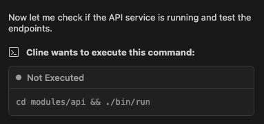

# How to Work With Bluetext

This guide outlines the core principles for working effectively with Bluetext. Adopting this workflow will help you build robust, maintainable applications faster, while retaining complete control over your code.

Bluetext is designed as a tool for capable developers, and is not targeted towards non-programmers. It's not an "autopilot" that generates entire applications from a single prompt.&#x20;

## **1. Build Incrementally, Not Monolithically**

We strongly recommend building your application one service at a time, instead of trying to generate a full stack app in a single, monolithic prompt. This atomic approach helps to facilitate a more granular control over your code base, resulting in higher quality applications.&#x20;

&#x20;✅ **Good:** "Add a Python FastAPI service to this project"

❌ **Bad:** "Build me a full-stack e-commerce app with user authentication, payment processing, inventory management, and a React frontend with Material UI"

The focused prompt yields precise, accurate results, whereas the broad request can make it harder to catch errors or halt unwanted behaviour in time.

An "atomic" command isn't just about adding a whole service; it applies to every stage of development. You can use focused, single-purpose prompts, e.g:

* **Add a new service**&#x20;
* **Add a feature to a service**&#x20;
* **Connect two services**&#x20;

## **2. Remain Involved In The Process**

Actively review, modify, and even reject the code and templates the LLM suggests. Don't hesitate to write or paste in your own code when you know exactly what you need. Direct intervention is often faster than trying to perfect a prompt, and it ensures the final code meets your standards for quality and logic. This workflow also conserves LLM tokens and keeps interactions fast, all while leaving you in complete control. Furthermore, intervening in the process by preventing long error correction loops helps to keep the context focused. This process will also help to keep the engineer informed about the structure of the project and the decisions the LLM made to construct it. A common operation that we recommend to reject is letting your coding agent open and navigate your browser since those operations are costly, both in terms of time and tokens. A developer on the other hand, can get these tasks done quickly, or alternatively the LLM will often be able to do the same thing using curl commands.

## **3. Keep Your Context Clean and Focused**

Get into the habit of frequently clearing the coding agent conversation context. The development context is managed by Bluetext, which means you can stop, clear the context, and pick up development from any point with confidence. A clean context also prevents the LLM from getting confused by irrelevant information for the task at hand that might be still polluting the context. This leads to more accurate responses and better performance.

## **4. Pause, Modify, and Resume at Any Stage of the Conversation**

You should never have to wait until the end to see if things work. Every service you scaffold with Bluetext is immediately containerised and integrated into a runnable toolchain. This provides an instant feedback loop, allowing you to spin up your entire application stack at any point with a single command: &#x20;


```markup
pt run default --mcp 
```


Because every service is containerized with sensible defaults, you get a predictable, reproducible environment that eliminates "works on my machine" issues. This modular, runnable setup also makes it trivial to expand your app by adding new capabilities, like an orchestration service (Temporal) or a different database (Couchbase), knowing the system will remain stable and testable

## **5. Container Orchistration and Polytope**

Because Polytope handles the container orchestration for your project, when you're connected to the Polytope MCP server, your coding agent should not run commands locally. For instance:

<figure><figcaption></figcaption></figure>


