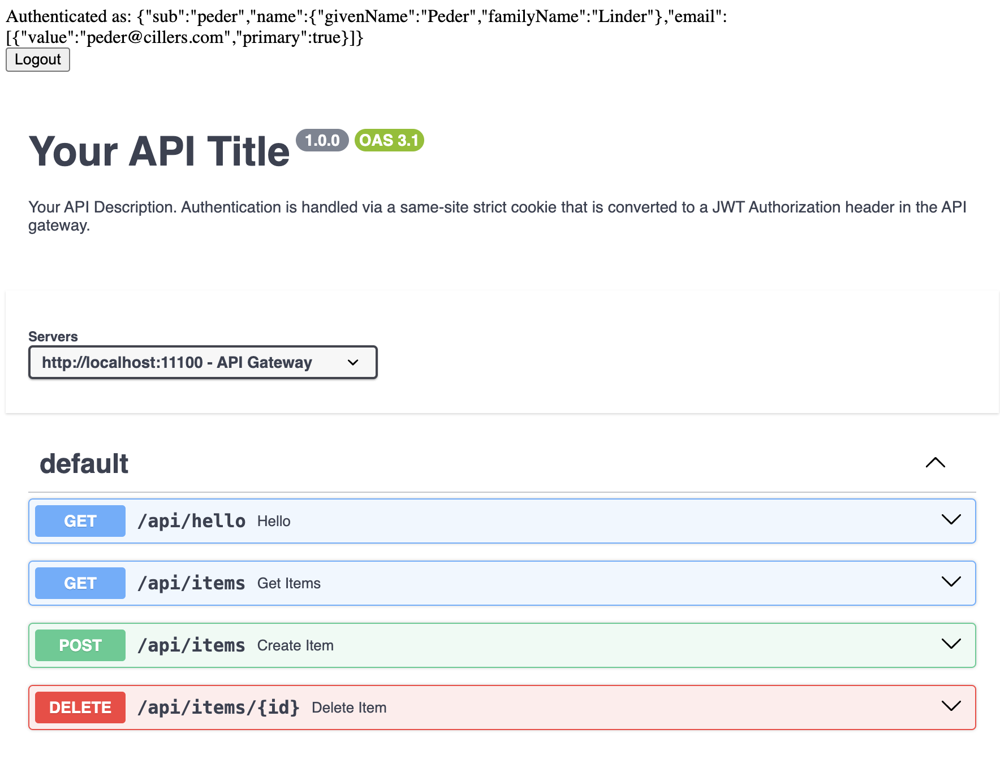

# REST Client

Your REST Client Web UI is located at [http://localhost:11002](http://localhost:11002). You should use the same login credentials for this service as you do for the web app.&#x20;

The main purpose of this service is to help you try out the REST queries that you plan to use in your web app.&#x20;

<figure><figcaption></figcaption></figure>
