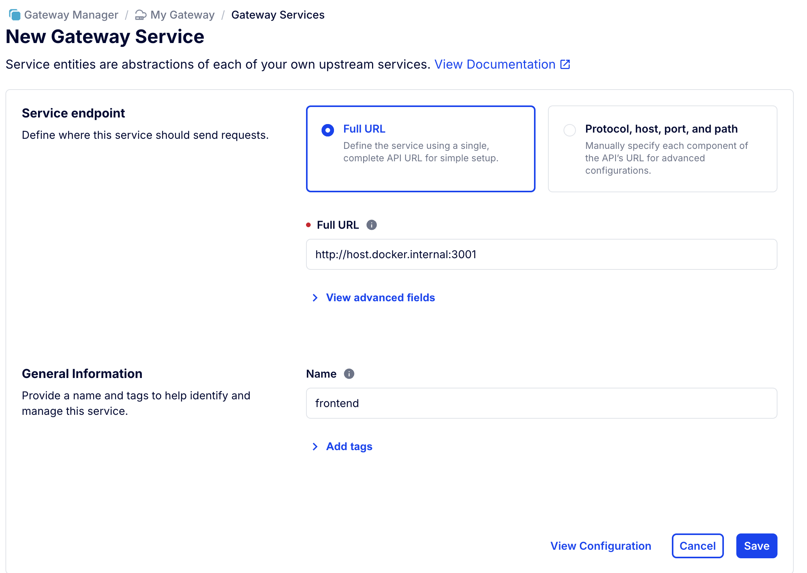

# Installation Instructions For Linux

### Supported Linux Distributions

Cillers generally operates well across most Linux distributions, but you may encounter specific issues depending on the version and distribution you are using. In particular, there is an outstanding problem with running our Identity Provisioning Service, Curity, on Arch Linux.&#x20;

### Install Git

Git is a distributed version control system that helps developers manage changes to source code over time. It allows you to track modifications, revert to previous versions of your code, and collaborate with others on the same project.  Website: [https://git-scm.com/](https://git-scm.com/)

Installation instructions: [https://git-scm.com/book/en/v2/Getting-Started-Installing-Git](https://git-scm.com/book/en/v2/Getting-Started-Installing-Git)

### Install Docker&#x20;

Docker enables developers to package software systems and applications into containers that include everything needed to run an application: code, runtime, libraries, and system tools. Website: [https://www.docker.com/](https://www.docker.com/)

Installation instructions: [https://docs.docker.com/engine/install](https://docs.docker.com/engine/install)

### Install Polytope

Polytope enables you to run and manage your software, underlying databases, pipelines and other software services. It makes it possible to seamlessly run your system anywhere, e.g. on your laptop, on your own servers, in your cloud or with any hyperscalar. Website: [https://polytope.com/](https://polytope.com/)

Installation instructions: [https://polytope.com/docs/quick-start](https://polytope.com/docs/quick-start)

### Install Insomnia by Kong

With Kong Insomnia you can create, organize, share, and execute any type of API call, including HTTP, REST, GraphQL, gRPC, SOAP, WebSockets. And especially important for the Cillers stack, it supports easy set up of oAuth-secured connections to APIs. Website: [https://insomnia.rest/](https://insomnia.rest/)

Installation instructions: [https://docs.insomnia.rest/insomnia/install](https://docs.insomnia.rest/insomnia/install)

### Enable Access To Self-Signed Certificates On Localhost

The Cillers stack is secured with https connections by default. But, to simplify development on your local development machine, e.g. laptop, you can disable certificate validations for localhost connections. Otherwise, you will need to set up and manage certificates on your development machine which can be a lot of work and offers no benefits for most scenarios.&#x20;

There are two applications that you need to do this in: your browser and your API client UI applications. Here are instructions for how to do this in our preferred browser, Chrome, and our preferred API client UI application, Insomnia. &#x20;

#### Insomnia

Uncheck "Validate certificates" in Settings > Request / Response.&#x20;

#### Chrome

Go to [chrome://flags/#allow-insecure-localhost](chrome://flags/#allow-insecure-localhost) and click enable.&#x20;

<figure><figcaption></figcaption></figure>
